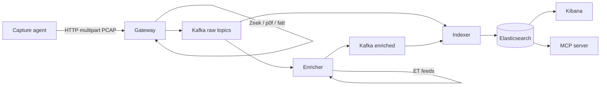

# Architecture

NetWatcher splits capture from analysis. Edge agents run a small Rust PCAP capturer; the central gateway runs Zeek, p0f, and fatt on uploaded PCAP files.

## Data flow



ASCII overview:

```
[Capture Agent]  Rust PCAP capturer ──HTTP multipart──> [Gateway + Zeek/p0f/fatt] --> [Kafka]
                                        |
                              [Enricher (ET feeds)]
                                        |
                                   [Kafka enriched]
                                        |
                                   [Indexer] --> [Elasticsearch] --> [Kibana]
                                                                --> [MCP Server]
```

## Components

| Component | Crate / image | Role |
|-----------|---------------|------|
| Capture agent | `netwatcher-capturer`, `netwatcher-shipper` | PCAP rotation, upload to gateway |
| Gateway | `netwatcher-gateway` | Ingest API, PCAP analysis, Kafka publish |
| Enricher | `netwatcher-enricher` | Emerging Threats IP matching |
| Indexer | `netwatcher-indexer` | Kafka consumer → Elasticsearch |
| MCP | `netwatcher-mcp` | Stdio MCP tools for AI agents |
| Kibana | Elastic 8.15 | Dashboards (imported at startup) |

Infrastructure in Docker Compose: Apache Kafka 3.9, Elasticsearch 8.15, Kibana 8.15.

## Event sources

Events are typed by source in `netwatcher-common`:

| Source | Kafka topic | ES index prefix | Origin |
|--------|-------------|-----------------|--------|
| `zeek` | `netwatcher.zeek` | `netwatcher-zeek-*` | Zeek logs from PCAP |
| `p0f` | `netwatcher.p0f` | `netwatcher-p0f-*` | Passive OS fingerprinting |
| `fatt` | `netwatcher.fatt` | `netwatcher-fatt-*` | TLS/SSH/HTTP metadata |
| `enriched` | `netwatcher.enriched` | `netwatcher-enriched-*` | Threat-matched events |

Zeek conn, dns, http, ssl, and other log types are routed within the zeek topic by `zeek_log_type`.

## Extension points

**New analyzers** — Add a supervisor program in `docker/capture/scripts/`, write logs to `/logs/<source>/`, extend `netwatcher-shipper` parser.

**New event sources** — Add a variant to `EventSource` in `netwatcher-common`, Kafka topic auto-created by gateway.

**New threat feeds** — Implement parser in `netwatcher-common/src/threat.rs`, register in enricher `feed.rs`.

**New MCP tools** — Add handler in `crates/netwatcher-mcp/src/server.rs` and register in `protocol.rs`.

## Deployment modes

| Mode | Use case | Docs |
|------|----------|------|
| Docker Compose (core) | Single-host lab or small deployment | [Getting started](getting-started.md) |
| Docker Compose + capture profile | Local NIC capture on the same host | [Capture agent](features/capture-agent.md) |
| Remote capture compose file | Edge sensors pointing at central gateway | [Capture agent](features/capture-agent.md) |
| Kubernetes | DaemonSet capture, scaled services | [Kubernetes deployment](features/kubernetes-deployment.md) |

## Related

- [Gateway API](features/gateway.md)
- [Security controls](features/security.md)
- [Configuration reference](features/configuration.md)
