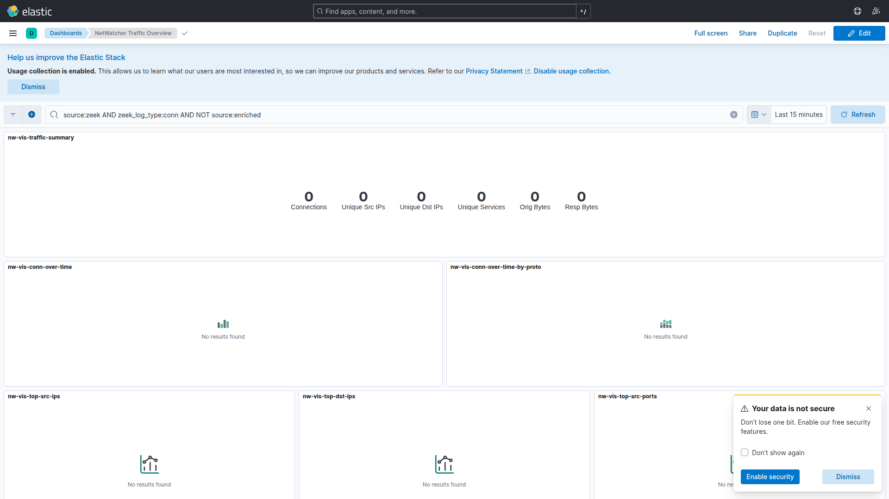
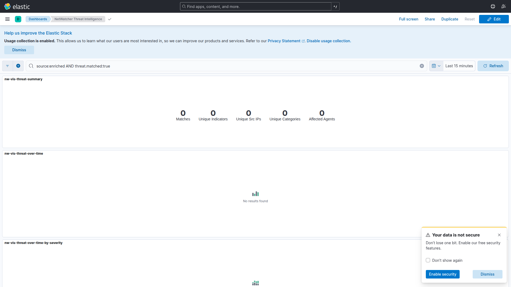
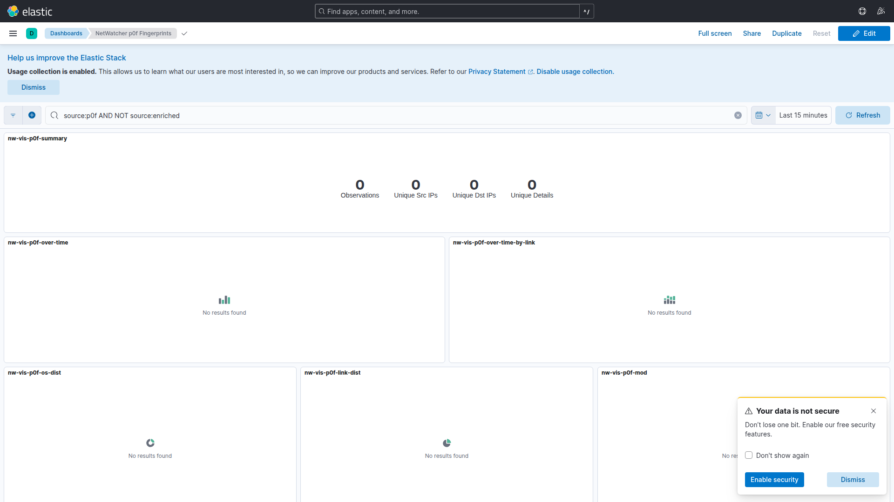
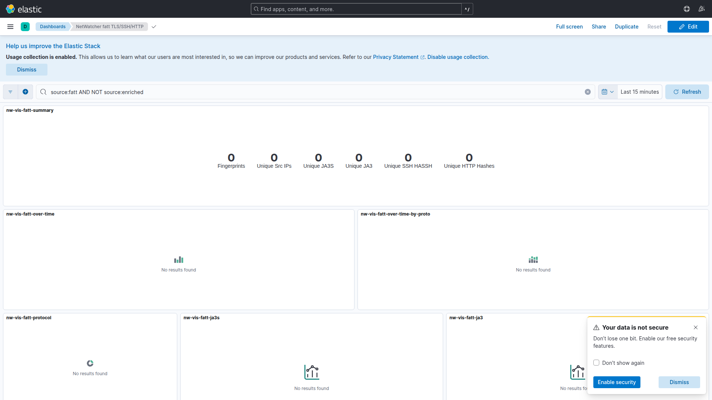
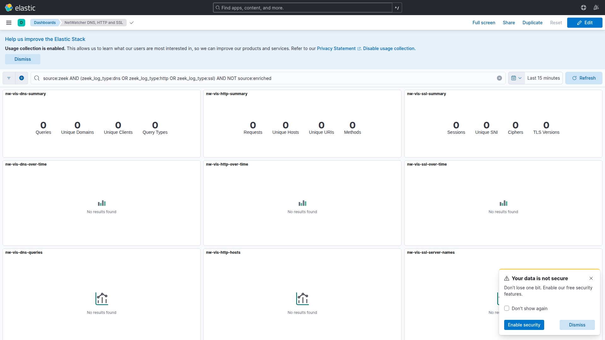
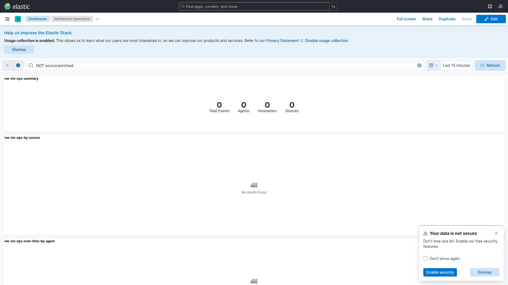

# Kibana dashboards

NetWatcher ships six Kibana dashboards. They import automatically when the stack starts via the `kibana-setup` Compose service (`kibana/import-dashboards.sh`).

Open Kibana at http://localhost:5601 → **Analytics → Dashboard**.


## Dashboards

### Traffic Overview

Connection summary metrics, timelines by protocol, top IPs and ports, services, IP pairs, and conn log search.



### Threat Intelligence

Match summary, severity timelines, categories and feeds, indicator matrix, affected agents and hosts, threat log search.



### p0f Fingerprints

OS and link-layer fingerprint metrics, timelines, distributions, source and destination IPs, agent breakdown, raw log search.



### fatt TLS/SSH/HTTP

JA3, JA3S, HASSH, and HTTP hash metrics, protocol timelines, TLS/SSH/HTTP tables, IP correlation, raw log search.



### DNS, HTTP and SSL

Per-protocol summaries, timelines, top domains and SNI, query types, ciphers, HTTP status codes, per-protocol log searches.



### Operations

Pipeline summary, source and agent timelines, source breakdown, Zeek log types, pipeline log search.



## Regenerating dashboards

Saved objects are generated from Python and stored as NDJSON:

```bash
python3 kibana/build-dashboards.py
# Output: kibana/dashboards/netwatcher-dashboards.ndjson
```

Restart the stack or re-run the import script to apply changes.

## Time range and data

Dashboards default to **Last 15 minutes**. If panels show no data:

1. Confirm the capture agent is running (`make up-capture`)
2. Widen the time picker (e.g. Last 24 hours)
3. Check Elasticsearch: `curl -s 'http://localhost:9200/netwatcher-*/_count'`

## Related

- [Getting started](../getting-started.md)
- [Indexer](indexer.md)
- [Enricher](enricher.md)
