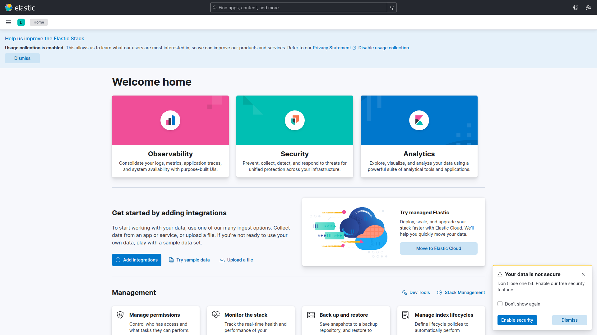

# Getting started

NetWatcher runs as a Docker Compose stack on a single host. You need Docker with rootful mode for local packet capture.

## Prerequisites

- Docker Engine 24+ with Compose v2
- 4 GB RAM minimum (Elasticsearch uses ~1 GB heap)
- For local capture: rootful Docker with `NET_RAW` and `NET_ADMIN` capability support

## Quick start

```bash
git clone https://github.com/brianlechthaler/netwatcher.git
cd netwatcher

# Core pipeline: Kafka, Elasticsearch, Kibana, gateway, enricher, indexer, MCP
make up

# Optional: local capture agent (requires CAP_NET_RAW)
make up-capture
```

Services bind to localhost only:

| Service | URL |
|---------|-----|
| Gateway | http://localhost:8080 |
| Kibana | http://localhost:5601 |
| Elasticsearch | http://localhost:9200 |

Verify the stack:

```bash
./scripts/verify-stack.sh
```


## Capture interface

The capture agent auto-selects the default-route interface when `CAPTURE_INTERFACE=auto` (default). Override for a specific NIC:

```bash
# One-shot
CAPTURE_INTERFACE=enp4s0 make up-capture

# Persistent: copy .env.example to .env and set CAPTURE_INTERFACE
cp .env.example .env
echo 'CAPTURE_INTERFACE=wlo1' >> .env
make up-capture
```

List interfaces on the host:

```bash
ip -br link show
```

## Remote capture agent

Run a lightweight agent on another machine that can reach the central gateway:

```bash
export GATEWAY_URL=http://<gateway-host>:8080
export AGENT_ID=edge-sensor-01
export CAPTURE_INTERFACE=auto   # or enp4s0, eth0, etc.
docker compose -f deploy/docker-compose/compose.capture.yaml up -d
```

See [Capture agent](features/capture-agent.md) for capability requirements and troubleshooting.

## Kibana

Open http://localhost:5601. Dashboards import automatically on first startup via the `kibana-setup` service.



Go to **Analytics → Dashboard** for NetWatcher dashboards. See [Kibana dashboards](features/kibana-dashboards.md).

## MCP in Cursor

Copy or merge `mcp/mcp.json` into your Cursor MCP config after the stack is running. See [MCP server](features/mcp-server.md).

## Stop the stack

```bash
make down
```

This stops core services and capture agents (capture profile included).

## Next steps

- [Architecture](architecture.md) for the full pipeline
- [Configuration](features/configuration.md) for production settings (`GATEWAY_API_KEY`, rate limits)
- [Kubernetes deployment](features/kubernetes-deployment.md) for cluster installs
